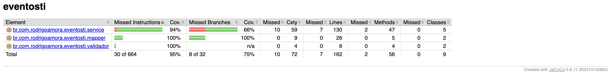

# eventosti_backend
📢 Descrição:
-------------
Projeto para divulgação de eventos de tecnologia, feito em Java 21 e Spring Boot e hospedado no AWS.

🚀 Dependências:
----------------
O projeto usa o Java 21 e as seguintes dependências:

* Spring Boot 3.4.5
* Spring Security
* Spring Data JPA
* Spring Actuator
* Devtools
* Thymeleaf
* Micrometer
* Swagger / OpenAPI
* OpenAPI
* MySQL
* H2
* jUnit

📌 Documentação dos Endpoints:
------------------------------
A API conta com documentação automática via Swagger e Redoc:<br>

<b>Documentação via Swagger:</b>
```shell script
http://localhost:8080/swagger-ui.html
```

<b>Documentação via Redoc:</b>
```shell script
http://localhost:8080/redoc.html
```

##
Na pasta <b>`postman`</b> contém a collection para usar os endpoints via Postman.

💾 Banco de dados:
------------------
O projeto usa o MySQL para os ambientes de desenvolvimento e produção e o H2 para os testes.

##
Para acessar o painel do H2:
```shell script
http://localhost:8080/h2-console
```

<b>OBS:</b> Para acessar o painel do H2 é preciso rodar a aplicação com properties de test.

🔧Configurações do projeto:
---------------------------
Crie o arquivo <b>`.env`</b> na raiz do projeto e adicione as seguinte variáveis nele:<br>
DB_URL=URL do bando de dados <br>
DB_USERNAME=usuário do bando da dados <br>
DB_PASSWORD=senha do bando da dados <br>

🔧Gerando o arquivo .jar:
-------------------------
Para gerar o arquivo <b>.jar</b>, execute o comando via terminal no diretório raiz do projeto:
```shell script
mvn clean install -P{profile} -DskipTests
```

✅ Rodando os testes:
---------------------
<b>A cobertura de testes do projeto:</b>


##

Para rodar os testes, execute o comando na raiz do projeto:
```shell script
mvn test
```

##
Para gerar o relatório de cobertura de testes do projeto com o JaCoCo, execute o comando na raiz do projeto:
```shell script
mvn clean test jacoco:report
```

💻 Rodando o projeto localmente:
--------------------------------
Para iniciar a aplicação localmente, execute o comando no diretório raiz do projeto via terminal:
```shell script
mvn spring-boot:run
```

🐳 Rodando o projeto no Docker:
-------------------------------
Para rodar o projeto via Docker, primeiro deve-se gerar o .jar do projeto.<br>
Após isso, deve-se gerar o build das imagens e subir os containers do Docker.<br><br>
<b>Fazendo o build das imagens:</b>
```shell script
docker-compose build
```

<b>Subindo os containers do Docker:</b>
```shell script
docker-compose up -d
```

##
Para automatizar esse processo, basta executar o Shellscript <b>`docker_build_and_run.sh`</b> na raiz do projeto:
```shell script
./docker_build_and_run.sh
```

🌐 Acesso ao projeto:
---------------------
O projeto está disponível através do endereço:<br>
http://eventosti.com.br

👤Autor:
--------
<b>Rodrigo Amora</b>

LinkedIn: https://linkedin.com/in/rodrigoamora <br>
E-mail: rodrigo.amora.freitas@gmail.com
